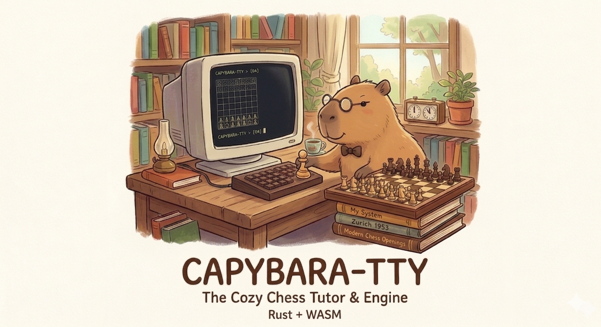

# 🦦 capybara-tty

The Cozy Chess Tutor & Engine | O Tutor e Motor de Xadrez Acolhedor

### 🇺🇸 English

#### Overview

capybara-tty is a distraction-free, terminal-inspired chess platform designed for education and focus. Powered by Rust and WebAssembly, it aims to bridge the gap between digital practice and physical play. Originally created to help children master chess without the noise of modern apps, it forces players to engage with chess notation and spatial awareness.

**Core Features** 

- Minimalist TUI-inspired Interface: A clean, dark UI that focuses on the board and the tutor's feedback.
- PGN-Only Input: Encourages players to learn and memorize algebraic notation (e.g., Nf3, e4).
- Physical Board Synchronization: An optional "Physical Mode" that pauses the game, requiring the player to replicate moves on a real wooden board.
- The Capybara Tutor: A rule-based mathematical tutor that guides you through openings, prevents "blunders" (hanging pieces), and explains historical matches.
- Hybrid Engine System: Runs a custom lightweight Rust engine for low-power devices (like Smart TVs) with an optional Stockfish.wasm integration for deep analysis.
- Privacy-First & Offline: Runs entirely in your browser via WASM. No servers, no tracking, no distractions.

**Tech Stack**

- Logic: Rust (compiled to WASM via wasm-pack)
- Rules Engine: shakmaty crate
- Frontend: HTML5, CSS (TUI Aesthetic), and JavaScript
- Engine: Custom Minimax implementation + stockfish.wasm

### 🇧🇷 Português

#### Visão Geral

O capybara-tty é uma plataforma de xadrez inspirada em terminais, livre de distrações e focada no ensino. Movido por Rust e WebAssembly, o projeto busca unir a prática digital ao jogo físico. Criado originalmente para ajudar crianças a dominar o xadrez sem o ruído dos aplicativos modernos, ele desafia o jogador a dominar a notação e a visão espacial.

**Principais Funcionalidades**

- Interface Estilo TUI: Uma UI escura e minimalista que mantém o foco total no tabuleiro e no tutor.
- Entrada Exclusiva por PGN: Estimula o aprendizado da notação algébrica (ex: Cf3, e4).
- Modo Tabuleiro Físico: Um modo opcional que pausa o jogo e exige que o jogador replique os movimentos em um tabuleiro real de madeira.
- O Tutor Capivara: Um guia matemático que ensina aberturas, evita que você "pendure" peças e explica partidas históricas.
- Motor Híbrido: Utiliza uma engine customizada em Rust para dispositivos leves (como Smart TVs) e integração opcional com Stockfish.wasm para análises profundas.
- Privacidade e Offline: Roda inteiramente no navegador via WASM. Sem servidores, sem rastreamento, sem distrações.

**Tecnologias**

- Lógica: Rust (compilado para WASM via wasm-pack)
- Regras: Crate shakmaty
- Frontend: HTML5, CSS (Estética TUI) e JavaScript
- Engine: Implementação Minimax customizada + stockfish.wasm

### 🛠️ Development | Desenvolvimento

#### Prerequisites

- Rust & Cargo
- wasm-pack

#### Build

Clone the repo

```bash
git clone https://github.com/seu-usuario/capybara-tty.git
```

#### Build the WASM package

```bash
wasm-pack build --target web
```

#### Sync `www` to GitHub Pages (`docs`)

Use a single command to rebuild wasm and mirror the playable site to `docs/`:

```bash
./scripts/publish_pages.sh
```

*“Transforming capybaras into grandmasters, one PGN at a time.”*

*“Transformando capivaras em mestres, um PGN de cada vez.”*

